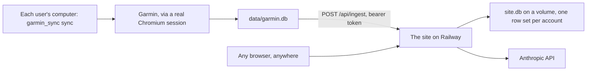

# garmincoach

Garmin data, pulled to your own computer through a real browser session,
published to a site anyone can sign up for, and handed to Claude so you can ask
it things.

Two halves, and the split matters:



The computer does the fetching because that's the only place it can be done.
The site does the looking and the thinking, because that's what you want from
the sofa.

## Multi-user, with one honest limitation

Anyone can create an account on the site, and every account is separate: its
own password, its own sync token, its own history. No query in
[`server/db.py`](server/db.py) runs without a user id, and every data row keeps
that id in its primary key, so one person's numbers cannot end up in another
person's charts.

What the site **cannot** do is fetch from Garmin on a user's behalf. Garmin's
login needs a real browser, a human for the MFA code, and Cloudflare clearance
tied to a home IP address (see below). So each user installs the sync tool on
their own machine, signs in to Garmin there once, and links the computer to
their site account in the browser. The site is the dashboard and the coach;
the fetching stays local, for everybody.

## Why it works this way

The old Python libraries (`garth`, `python-garminconnect`) broke in early 2026:
Garmin changed their login flow and Cloudflare now blocks known HTTP-library
fingerprints. A **real browser** isn't blocked. So this drives a persistent
Chromium profile -- you log in by hand once (including MFA), the session is
saved, and every later run reuses it headlessly. Data is then fetched by
calling Garmin's own JSON endpoints under `connect.garmin.com/gc-api/` through
the browser session, authenticated by its cookies -- exactly as the web app
does. No password and no token ever touch the code.

That also explains why the deployed site never talks to Garmin. Cloudflare
clearance is tied to your IP and your login needs your hands on it, so a server
in a datacentre would be locked out within a day. Each user's machine pushes
summaries to the site instead, over one authenticated endpoint.

---

# Part 1: your own computer

## Install (Python 3.11+)

```bash
cd garmincoach
python3 -m venv .venv && source .venv/bin/activate
pip install -r requirements-local.txt
playwright install chromium
```

## Use it

```bash
# One time: a Chromium window opens; sign into Garmin yourself (incl. MFA).
python -m garmin_sync login

# Any time after: fetch what's missing and publish it to your site.
python -m garmin_sync sync
```

`sync` is `pull` + `push`: it looks at the last day already stored, fetches
only what's missing up to today, and sends the result to your site. First time
you need the site address, link once so the token is saved for you:

```bash
python -m garmin_sync link --url https://your-app.up.railway.app
python -m garmin_sync pull --since 14d   # fetch, summarize, write a JSON file
python -m garmin_sync push --all         # publish the entire local history
```

Each `pull` writes `data/garmin_YYYY-MM-DD.json`, a compact bundle you can
still drag straight into a Claude chat. History accumulates in
`data/garmin.db` (SQLite), which is what `push` reads from.

Flags for `pull`: `--since 30d` or `--since 2026-06-01`, `--full` to keep raw
data instead of summarizing, `--headless` to hide the browser, `--limit N` for
how many recent activities to scan. For `push`: `--all` for everything,
`--since 90d` for a range (the default is the last 30 days, which is enough to
catch devices that synced late).

## Or don't use the terminal

Double-click **`Garmin Sync.command`**. The first launch sets up the
environment; after that it opens a small window:

- **Log in** -- one-time visible sign-in. Reused after.
- **Update & publish** -- the main button: fetch what's missing, send it to the
  site.
- **Fill the blank** -- fetch without publishing.
- **Fetch the last N days** -- a specific recent range.
- **My site** -- paste the address once, click **Connect** (browser opens;
  approve on the site). Then **Publish everything** for the first upload.
- **Combine full history → 1 file** -- writes `data/garmin_history.json` for
  dragging into Claude by hand.

It wraps the same engine as the CLI (`garmin_sync/core.py`), so both stay in
sync. If your Python was built without Tk (common with Homebrew Python -- you'd
see `No module named '_tkinter'`), the launcher falls back to an identical
local web interface in your browser. Launch either directly with
`python -m garmin_sync.app` or `python -m garmin_sync.webapp`.

---

# Part 2: the site

A FastAPI app in [`server/`](server/) that reads the pushed history, computes
the interesting numbers, and puts Claude next to them. It's built for Railway
but it's a plain ASGI app, so anywhere works.

## Deploy on Railway

**1. Push the code.**

```bash
npm i -g @railway/cli
railway login       # opens a browser
railway init        # names the project
railway up          # builds and deploys
railway domain      # assigns the public URL
```

Railway builds with Railpack: it reads `requirements.txt` (server dependencies
only -- Playwright deliberately isn't there, since the container never drives a
browser) and takes the start command from `railpack.json`. Nothing else to
configure for the build.

**2. Attach a volume.** This is the step people skip and then lose their data
to. SQLite is a file, and the container's disk is wiped on every deploy. In the
dashboard: open the service → **Data** → **New Volume** → mount path **`/data`**.
The app reads `RAILWAY_VOLUME_MOUNT_PATH`, which Railway sets by itself, so
`/data` is all it needs to know.

**3. Set one variable.** Service → **Variables**:

| Variable | | What it does |
| --- | --- | --- |
| `OPENAI_API_KEY` | | Switches the coach on (GPT). Without it the site works, but the Coach tab says so. |
| `ANTHROPIC_API_KEY` | | Alternative to OpenAI. Ignored if `OPENAI_API_KEY` is set. |

That's the only one that changes anything. Everything else has a working
default, including the secret that signs session cookies: it's generated on
first boot and kept in the database on the volume, so sign-ins survive
restarts without you configuring anything.

The rest, if you want them:

| Variable | Default | What it does |
| --- | --- | --- |
| `OPENAI_MODEL` | `gpt-4.1` | Which OpenAI model answers. |
| `ANTHROPIC_MODEL` | `claude-sonnet-4-5` | Which Claude model answers (if using Anthropic). |
| `COACH_DAILY_LIMIT` | `0` (no limit) | Coach questions per user per day. The API key is shared by every account, so this is the dial to turn if the bill gets interesting. |
| `COACH_MAX_TOKENS` | `1500` | Ceiling on a single answer. |
| `COACH_DETAIL_DAYS` | `90` | How many days the coach sees day by day. |
| `SIGNUP_OPEN` | `1` | Set to `0` to stop new accounts without a redeploy. Existing users keep working. |
| `MIN_PASSWORD` | `8` | Shortest password accepted at signup. |
| `SESSION_DAYS` | `30` | How long a sign-in lasts. |
| `SESSION_SECRET` | auto | Overrides the stored secret. Setting or changing it signs every device out -- the emergency lever if a cookie leaks. |
| `DEFAULT_WINDOW_DAYS` | `90` | The dashboard's default range. |
| `SYNC_REPO_URL` | this repo | Where new users are sent to get the sync tool. |

**4. Optional: connect GitHub.** Link the repo to the service and every push to
your chosen branch deploys itself, so `railway up` stops being part of your
life.

Then each user (you included) points their machine at it, once:

```bash
python -m garmin_sync link --url https://your-app.up.railway.app
```

A browser opens on the site. Sign in if needed, click **Connect this computer**,
and the sync token is saved locally — nobody copies it by hand. After that,
`python -m garmin_sync sync` is the whole ritual (fetch what's missing, publish).

The Account tab still shows the raw token for recovery, and the empty dashboard
prints the same `link` command with the site URL filled in.

`railway.json` pins the start command and sets `overlapSeconds: 0`. That last
one matters more than it looks: Railway normally runs the old and new
containers side by side for a moment during a deploy, and with one SQLite file
on one volume that would mean two processes writing to the same database.

## Run it locally first

Worth doing before you deploy anything:

```bash
uvicorn server.main:app --port 8000
```

No variables needed. It writes `data/site.db` -- a different file from the
`data/garmin.db` your sync owns, so the local server and the local sync never
tread on each other. Sign up with any email; nothing is sent anywhere.

## What the site shows

**Load and form.** Training load per day, then two exponential moving averages
of it: ATL over 7 days is the fatigue you're carrying, CTL over 42 days is the
fitness you've built, and form is CTL minus ATL. Negative form means you're
digging; positive means you're rested, or detraining. The load ratio (ATL/CTL)
is the same story as one number: roughly 0.8-1.3 is productive, and above 1.5
is where injuries cluster.

**Recovery against baseline.** HRV, resting HR, sleep score and training
readiness, each drawn next to its own trailing 7-day average. An HRV of 45 is
excellent for one person and a warning for another; the distance from *your*
baseline is the part that means something.

**Sleep** by stage, **weekly volume** by sport, and a scatter of yesterday's
load against this morning's HRV -- the pairing that answers whether your body
is absorbing the work.

Everything is computed on the fly from a few thousand tiny rows, so there's no
cache to go stale. Ask for a year when you only have a month and the window
quietly shrinks to the data you actually have.

## The coach

The Coach tab has two things: a briefing regenerated once a day and cached
(rereading it is free), and a chat box for follow-ups.

What Claude gets isn't the raw database. It's three compact CSV tables -- the
last 90 days one line per day, every week of your entire history one line each,
and the last four weeks of sessions -- plus the current headline numbers. A
year of history costs a few thousand tokens instead of tens of thousands, and
the model sees trends without drowning in detail. The prompt lives in
[`server/coach.py`](server/coach.py); it's the first thing to edit if you want
a different kind of coach.

The site's numbers and the coach's numbers are computed by the same module
([`garmin_sync/metrics.py`](garmin_sync/metrics.py)) over the same window, so
the chart and the advice can't disagree.

The coach only ever sees the history of the account asking. It reads through
the same user-scoped queries as the charts, so there is no path by which one
user's data reaches another user's conversation.

## What "summarize" means

Garmin returns megabytes of per-second streams. By default each activity is
trimmed to the metrics that matter (type, duration, distance, HR, pace,
training effect, load) and each day collapses to one compact record (sleep
stages + score, resting HR, HRV, Body Battery, stress, steps, readiness). A
single run's payload drops from ~80 KB of raw streams to a few hundred bytes.
Use `--full` if you ever want the raw data.

## If something goes wrong

**`pull` reports failed endpoints.** Auth is via your session cookies. A 401
means the saved session went stale: run `python -m garmin_sync login --fresh`
to wipe it and log in clean. If one specific metric consistently fails, Garmin
may have moved that path; run `python -m garmin_sync doctor` to see the live
paths and reconcile `garmin_sync/endpoints.py`.

**`push` says 401.** The token in `data/config.json` isn't a token the site
recognises -- most often because it was replaced from the Account tab. Run
`python -m garmin_sync link` again. **404** usually
means the URL is wrong.

**The Coach tab says the coach is off.** Neither `OPENAI_API_KEY` nor
`ANTHROPIC_API_KEY` is set on the service. The deploy log says so too: the app
prints what it found on startup, including how many accounts exist and whether
a volume is attached.

**Data disappeared after a deploy.** No volume, or it isn't mounted at
`/data`. Push again with `--all` once it is. If accounts vanished too, that's
the same cause: users live in the same file.

## Honest caveats

- **Fragile by nature.** The sync rides Garmin's web app. When they change the
  site or tighten Cloudflare, a pull may break until you re-login. The official
  Garmin account data export (Settings → Data Management) is the
  zero-maintenance fallback that never breaks.
- **Session is IP-bound.** Cloudflare clearance is tied to your IP; if it
  changes, you may need to `login` again.
- **Signup is open, and the Anthropic key is shared.** Anyone who finds the URL
  can create an account and ask the coach questions on your API key. Set
  `COACH_DAILY_LIMIT` to cap it, or `SIGNUP_OPEN=0` to close the door.
- **It's health data on the public internet.** Passwords are scrypt-hashed,
  sessions are HMAC-signed and expire, sync tokens are 32 random bytes and can
  be replaced from the Account tab, and sign-in attempts are throttled per
  address. But there's no email verification and no password reset: forget a
  password and the account is gone. Nothing here has been through a security
  audit.
- **One SQLite file.** Fine for a handful of people pushing once a day, which
  is what this is for. A real user base wants Postgres, which is roughly a
  day's work from here.
- **Terms of service.** This accesses your own data (GDPR Article 20 gives you
  a portability right to it), but automated access still runs against Garmin's
  developer terms. Keep request volume low and personal.

## Layout

```
garmin_sync/          each user's own computer
  auth.py             persistent-profile login + session reuse
  client.py           authenticated, concurrent JSON fetch through the browser
  endpoints.py        Garmin endpoint paths (baked in, stable)
  summarize.py        drop heavy streams, roll up daily wellness
  metrics.py          load/form, baselines, weekly rollups (shared with the site)
  store.py            SQLite + compact JSON export
  cli.py              login / pull / push / link / sync / doctor
  core.py             pull / fill_the_blank / push / link / sync
  app.py, webapp.py   the desktop window and its no-Tk fallback
server/               the site
  main.py             routes
  config.py           everything from the environment
  store.py            accounts + everyone's data, user id in every key
  db.py               one short-lived connection per request, always scoped
  security.py         scrypt passwords, signed sessions, per-user sync tokens
  coach.py            context building and the Anthropic calls
  static/             the page itself (Chart.js from a CDN, no build step)
data/                 garmin.db (yours), site.db (the site's), session, config
```
