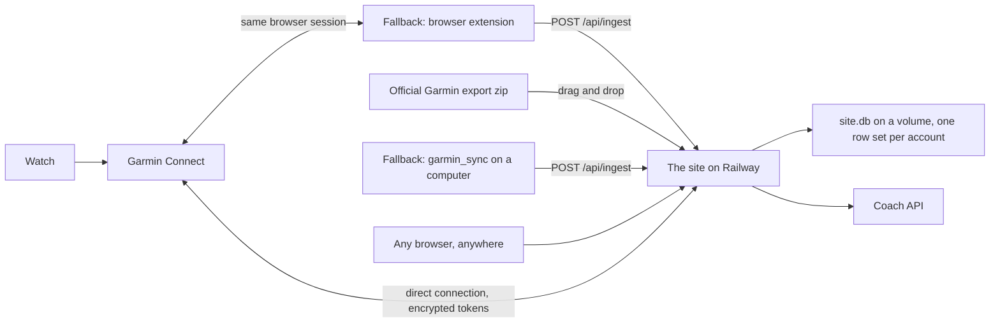

# gepard.fit

Live at [gepard.fit](https://gepard.fit). The repository is still called
`garmincoach`.

Garmin data, published to a site anyone can sign up for, and handed to a coach
so you can ask it things.

The usual way in is **Connect Garmin** on the site: sign in to Garmin once
(email, password, and the code if Garmin asks for one), and the server keeps
your data up to date by itself every few hours. Your password is used for that
one sign-in and never stored; what's kept is an encrypted access token you can
revoke from Settings → Data sources.

Two fallbacks feed the same pipeline: a **browser extension** that syncs
through the Garmin Connect tab you're already signed into, and Garmin's
official **export zip** for years of history in one go. The original computer
sync is still there too.


```mermaid
flowchart LR
  Watch["Watch"] --> Garmin["Garmin Connect"]
  Site["The site on Railway"] <-->|"direct connection, encrypted tokens"| Garmin
  Garmin <-->|"same browser session"| Ext["Fallback: browser extension"]
  Ext -->|"POST /api/ingest"| Site
  Zip["Official Garmin export zip"] -->|"drag and drop"| Site
  Mac["Fallback: garmin_sync on a computer"] -->|"POST /api/ingest"| Site
  Site --> Volume["site.db on a volume, one row set per account"]
  Site --> Claude["Coach API"]
  Phone["Any browser, anywhere"] --> Site
```

## Multi-user, with one honest limitation

Anyone can create an account on the site, and every account is separate: its
own password, its own sync token, its own history. No query in
[`server/db.py`](server/db.py) runs without a user id, and every data row keeps
that id in its primary key, so one person's numbers cannot end up in another
person's charts.

The limitation: the direct connection signs in the way Garmin's mobile app
does, through [`garminconnect`](https://github.com/cyberjunky/python-garminconnect)
0.3+, which presents a browser-like TLS fingerprint (`curl_cffi`) to get past
Cloudflare. It works today, but it's unofficial, and datacentre IPs are the
first thing Cloudflare tightens on. If the server gets blocked, the extension
(which runs inside your own browser) and the export zip keep working, and the
site says "Reconnect Garmin" instead of failing silently. Run
`python scripts/garmin_spike.py --email you@example.com` locally and through
`railway ssh` to check both before you rely on it.

### How the direct connection works

- `POST /api/garmin/connect` signs in; if Garmin wants a code it answers with
  a `challenge_id` and `POST /api/garmin/mfa` finishes the sign-in. The
  pending login lives in memory for five minutes.
- Tokens are encrypted with Fernet ([`server/garmin_connect.py`](server/garmin_connect.py))
  under `GARMIN_TOKEN_KEY`, or a key generated on first boot and kept in the
  database. They're refreshed and re-saved after every sync, and deleted on
  Disconnect or account deletion.
- A scheduler in the app's lifespan syncs every connected account every
  `GARMIN_SYNC_HOURS`, one at a time with jitter, and opening the site starts a
  sync when the last one is over an hour old. Across all accounts, at most
  `GARMIN_MAX_PARALLEL_SYNCS` talk to Garmin at once. Each run fetches the new
  days, writes queued workouts to Garmin, then walks a little further back into
  the history until it reaches the start (five years of wellness takes a couple
  of days of runs). A run that fails waits 15 minutes, then an hour, before the
  next attempt.
- The fetch plan is the same one the extension runs (`server/garmin_fetch.py`),
  and the results go through the same `ingest.normalise`, so all sources store
  identical rows. A per-user lock keeps two syncs of one account from
  overlapping.

## Why the computer sync works this way

The old Python libraries (`garth`, `python-garminconnect` before 0.3) broke in
early 2026: Garmin changed their login flow and Cloudflare blocked known
HTTP-library fingerprints. A **real browser** isn't blocked. So this drives a persistent
Chromium profile -- you log in by hand once (including MFA), the session is
saved, and every later run reuses it headlessly. Data is then fetched by
calling Garmin's own JSON endpoints under `connect.garmin.com/gc-api/` through
the browser session, authenticated by its cookies -- exactly as the web app
does. No password and no token ever touch the code.

---

# Part 1: your own computer

## Install (Python 3.11+)

```bash
cd garmincoach
python3 -m venv .venv && source .venv/bin/activate
pip install -r requirements-local.txt
playwright install chromium
```

## Use it

```bash
# One time: a Chromium window opens; sign into Garmin yourself (incl. MFA).
python -m garmin_sync login

# Any time after: fetch what's missing and publish it to your site.
python -m garmin_sync sync
```

`sync` is `pull` + `push`: it looks at the last day already stored, fetches
only what's missing up to today, and sends the result to your site. First time
you need the site address, link once so the token is saved for you:

```bash
python -m garmin_sync link --url https://gepard.fit
python -m garmin_sync pull --since 14d   # fetch, summarize, write a JSON file
python -m garmin_sync push --all         # publish the entire local history
```

Each `pull` writes `data/garmin_YYYY-MM-DD.json`, a compact bundle you can
still drag straight into a Claude chat. History accumulates in
`data/garmin.db` (SQLite), which is what `push` reads from.

Flags for `pull`: `--since 30d` or `--since 2026-06-01`, `--full` to keep raw
data instead of summarizing, `--headless` to hide the browser, `--limit N` for
how many recent activities to scan. For `push`: `--all` for everything,
`--since 90d` for a range (the default is the last 30 days, which is enough to
catch devices that synced late).

## Or don't use the terminal

Double-click **`Garmin Sync.command`**. The first launch sets up the
environment; after that it opens a small window:

- **Log in** -- one-time visible sign-in. Reused after.
- **Update & publish** -- the main button: fetch what's missing, send it to the
  site.
- **Fill the blank** -- fetch without publishing.
- **Fetch the last N days** -- a specific recent range.
- **My site** -- paste the address once, click **Connect** (browser opens;
  approve on the site). Then **Publish everything** for the first upload.
- **Combine full history → 1 file** -- writes `data/garmin_history.json` for
  dragging into Claude by hand.

It wraps the same engine as the CLI (`garmin_sync/core.py`), so both stay in
sync. If your Python was built without Tk (common with Homebrew Python -- you'd
see `No module named '_tkinter'`), the launcher falls back to an identical
local web interface in your browser. Launch either directly with
`python -m garmin_sync.app` or `python -m garmin_sync.webapp`.

---

# Part 2: the site

A FastAPI app in [`server/`](server/) that reads the pushed history, computes
the interesting numbers, and puts Claude next to them. It's built for Railway
but it's a plain ASGI app, so anywhere works.

## Deploy on Railway

**1. Push the code.**

```bash
npm i -g @railway/cli
railway login       # opens a browser
railway init        # names the project
railway up          # builds and deploys
railway domain      # assigns the public URL
```

Railway builds with Railpack: it reads `requirements.txt` (server dependencies
only -- Playwright deliberately isn't there, since the container never drives a
browser) and takes the start command from `railpack.json`. Nothing else to
configure for the build.

**2. Attach a volume.** This is the step people skip and then lose their data
to. SQLite is a file, and the container's disk is wiped on every deploy. In the
dashboard: open the service → **Data** → **New Volume** → mount path **`/data`**.
The app reads `RAILWAY_VOLUME_MOUNT_PATH`, which Railway sets by itself, so
`/data` is all it needs to know.

**3. Set one variable.** Service → **Variables**:

| Variable | | What it does |
| --- | --- | --- |
| `OPENAI_API_KEY` | | Switches the coach on (GPT). Without it the site works, but Coaching says so. |
| `ANTHROPIC_API_KEY` | | Alternative to OpenAI. Ignored if `OPENAI_API_KEY` is set. |

That's the only one that changes anything. Everything else has a working
default, including the secret that signs session cookies: it's generated on
first boot and kept in the database on the volume, so sign-ins survive
restarts without you configuring anything.

**4. Set three more before real users arrive.** Each has a default that works,
but the default is the wrong long-term answer:

| Variable | Why |
| --- | --- |
| `TZ` | e.g. `Europe/Rome`. "Today" (the briefing, today's decision, which session is due) follows the server clock, and Railway's is UTC, so without it the day turns over two hours late in Italy. |
| `GARMIN_TOKEN_KEY` | Keeps the key for the stored Garmin tokens out of the database, so the file (and every backup of it) can't be used to read them. Set it before anyone connects Garmin: changing it later asks everyone to connect again. |
| `SESSION_SECRET` | Same idea for the cookie-signing secret. Setting it signs everyone out once, so do it early. |

The deploy log lists whichever of these is missing.

The rest, if you want them:

| Variable | Default | What it does |
| --- | --- | --- |
| `OPENAI_MODEL` | `gpt-4.1` | Which OpenAI model answers. |
| `ANTHROPIC_MODEL` | `claude-sonnet-4-5` | Which Claude model answers (if using Anthropic). |
| `COACH_DAILY_LIMIT` | `30` | Coach questions (and the daily briefing) per user per day. The API key is shared by every account and signup is open, so keep a ceiling. `0` removes it. |
| `COACH_TIMEOUT_SECONDS` | `60` | Longest a provider call may take before it fails. A hung call holds one of the server's worker threads. |
| `COACH_MAX_TOKENS` | `1500` | Ceiling on a single answer. |
| `COACH_DETAIL_DAYS` | `90` | How many days the coach sees day by day. |
| `SIGNUP_OPEN` | `1` | Set to `0` to stop new accounts without a redeploy. Existing users keep working. |
| `MIN_PASSWORD` | `8` | Shortest password accepted at signup. |
| `ADMIN_EMAILS` | | Comma-separated emails that get an **Admin** area listing every registered account (email, role, signup date, verified) and the beta feedback users send from **Send feedback** in the account menu. Each message is also emailed to these addresses when account emails are on. Everyone else gets a 404. |
| `SESSION_DAYS` | `30` | How long a sign-in lasts. |
| `SESSION_SECRET` | auto | Overrides the stored secret. Setting or changing it signs every device out -- the emergency lever if a cookie leaks. |
| `DEFAULT_WINDOW_DAYS` | `90` | The dashboard's default range. |
| `SYNC_REPO_URL` | this repo | Where new users are sent to get the sync tool. |
| `GARMIN_TOKEN_KEY` | auto | Fernet key for the stored Garmin tokens. Without it a key is generated and kept in the database, next to the tokens; set it (`python -c "from cryptography.fernet import Fernet; print(Fernet.generate_key().decode())"`) so a copy of the database alone can't be used. Changing it asks every user to connect Garmin again. |
| `GARMIN_SYNC_HOURS` | `4` | How often the server syncs each connected account. |
| `GARMIN_SCHEDULER` | `1` | Set to `0` to stop background syncs; opening the site and **Sync now** still work. |
| `GARMIN_MAX_PARALLEL_SYNCS` | `2` | Syncs talking to Garmin at once, across all accounts. They all leave from the same IP and Garmin rate limits per IP, so raise it carefully. |
| `TRUSTED_PROXY_HOPS` | `1` | Proxies in front of the app that append to `X-Forwarded-For` (Railway's edge is one). Sign-in throttling counts the address that many hops from the right, so a client can't dodge it by sending its own header. `0` uses the socket address. |
| `BACKUP_KEEP` | `7` | Daily database snapshots kept in `/data/backups`. `0` turns them off. |
| `ACCOUNT_EMAILS` | `0` | Set to `1` for email verification, password reset and email change. Needs the two below and a domain verified on Resend. |
| `RESEND_API_KEY` | | Resend key the account emails are sent with. |
| `EMAIL_FROM` | `gepard.fit <onboarding@resend.dev>` | Sender, e.g. `gepard.fit <noreply@gepard.fit>`; the domain must be verified on Resend. |

**5. Backups.** The app writes a consistent snapshot of the database to
`/data/backups/site-YYYY-MM-DD.db` once a day and keeps the last
`BACKUP_KEEP`. Those copies live on the same volume: they cover a bad deploy
or a mistaken deletion, not losing the volume. For that, turn on backups for
the volume in Railway (service → **Data** → the volume → **Backups**). To
restore, stop the service, copy a snapshot over `/data/site.db` (and delete
`site.db-wal` and `site.db-shm` next to it), then start it again.

**6. Optional: connect GitHub.** Link the repo to the service and every push to
your chosen branch deploys itself, so `railway up` stops being part of your
life.

**7. Custom domain.** Service → **Settings** → **Networking** → **Custom
Domain**, enter `gepard.fit` (and `www.gepard.fit` if you want it), and add
the records Railway shows at the registrar. Once the certificate is issued,
set `PUBLIC_URL=https://gepard.fit`: pages opened on any other address
redirect there, email links use it, and `/api/` keeps answering on the old
Railway address so linked extensions and computers don't break.

Then each user signs up and clicks **Connect Garmin** on the first screen.
That's it; the first weeks arrive within a minute and older history follows in
the background.

If the direct connection is blocked, the same screen offers the browser
extension and the export zip under **Other ways to import**. The computer sync
still works too:

```bash
python -m garmin_sync link --url https://gepard.fit
```

A browser opens on the site. Sign in if needed, click **Connect this computer**,
and the sync token is saved locally. Settings → Data sources → Advanced shows
the same command and the raw token for recovery.

`railway.json` pins the start command and sets `overlapSeconds: 0`. That last
one matters more than it looks: Railway normally runs the old and new
containers side by side for a moment during a deploy, and with one SQLite file
on one volume that would mean two processes writing to the same database. It
also points Railway's health check at `/api/config` and restarts the container
whenever it stops, not just for the first few crashes.

## Run it locally first

Worth doing before you deploy anything:

```bash
uvicorn server.main:app --port 8000
```

No variables needed. It writes `data/site.db` -- a different file from the
`data/garmin.db` your sync owns, so the local server and the local sync never
tread on each other. Sign up with any email; nothing is sent anywhere.

## What the site shows

Five areas, each with its own address (`#/today`, `#/training/calendar`,
`#/insights/recovery`, …), so reload, back and links all work. A sidebar on
desktop, a bottom bar on the phone, and a pill in the top bar that says how
fresh the data is.

- **Today**: a one-line read on readiness, today's session with keep / ease /
  swap / rest, the six headline numbers, the next race, the coach's briefing
  and the latest note from your human coach.
- **Training**: Calendar (the plan, paces, pace check, send to watch), Races
  (goals, feasibility, generate a plan) and Workouts (builder and library).
- **Insights**: Load, Recovery, Performance and Activities, with a 30 / 90 /
  365 / all range. The `?` next to a number explains it.
- **Coaching**: the AI coach and your human coach in one place.
- **Settings**: Profile (availability, heart rate, weight), Data sources and
  Account.

Coach accounts get an **Athletes** area on top: a roster with form, load ratio,
HRV and data freshness flagged green / amber / red, the requests waiting, and
each athlete's Training and Insights read-only, plus notes and assigning a
workout.

**Load and form.** Training load per day, then two exponential moving averages
of it: ATL over 7 days is the fatigue you're carrying, CTL over 42 days is the
fitness you've built, and form is CTL minus ATL. Negative form means you're
digging; positive means you're rested, or detraining. The load ratio (ATL/CTL)
is the same story as one number: roughly 0.8-1.3 is productive, and above 1.5
is where injuries cluster.

**Recovery against baseline.** HRV, resting HR, sleep score and training
readiness, each drawn next to its own trailing 7-day average. An HRV of 45 is
excellent for one person and a warning for another; the distance from *your*
baseline is the part that means something.

**Sleep** by stage, **weekly volume** by sport, and a scatter of yesterday's
load against this morning's HRV -- the pairing that answers whether your body
is absorbing the work.

Everything is computed on the fly from a few thousand tiny rows, so there's no
cache to go stale. Ask for a year when you only have a month and the window
quietly shrinks to the data you actually have.

**Performance.** VDOT and critical speed from your best efforts, a pace
curve, Daniels/Riegel race predictions (next to Garmin's when we have them),
and training paces the planner uses.

**Plan.** Add an A-race, generate a periodized block (base / build / peak /
taper) with an 8% weekly-load cap and a projected form curve. Today's card
can ease or rest the session if recovery is off. **Send to watch** queues
the next two weeks; with the direct connection they're written to Garmin right
away, otherwise the extension writes them on its next sync.

**Workouts.** Build a structured session (run, bike, swim, strength),
preview it, save it, or schedule it for a day. Same write path as the plan.

## The coach

The AI coach has two things: a briefing regenerated once a day and cached
(rereading it is free), and a chat box for follow-ups.

What Claude gets isn't the raw database. It's three compact CSV tables -- the
last 90 days one line per day, every week of your entire history one line each,
and the last four weeks of sessions -- plus the current headline numbers. A
year of history costs a few thousand tokens instead of tens of thousands, and
the model sees trends without drowning in detail. The prompt lives in
[`server/coach.py`](server/coach.py); it's the first thing to edit if you want
a different kind of coach.

The site's numbers and the coach's numbers are computed by the same module
([`garmin_sync/metrics.py`](garmin_sync/metrics.py)) over the same window, so
the chart and the advice can't disagree.

The coach only ever sees the history of the account asking. It reads through
the same user-scoped queries as the charts, so there is no path by which one
user's data reaches another user's conversation.

## What "summarize" means

Garmin returns megabytes of per-second streams. By default each activity is
trimmed to the metrics that matter (type, duration, distance, HR, pace,
training effect, load) and each day collapses to one compact record (sleep
stages + score, resting HR, HRV, Body Battery, stress, steps, readiness). A
single run's payload drops from ~80 KB of raw streams to a few hundred bytes.
Use `--full` if you ever want the raw data.

## If something goes wrong

**`pull` reports failed endpoints.** Auth is via your session cookies. A 401
means the saved session went stale: run `python -m garmin_sync login --fresh`
to wipe it and log in clean. If one specific metric consistently fails, Garmin
may have moved that path; run `python -m garmin_sync doctor` to see the live
paths and reconcile `garmin_sync/endpoints.py`.

**`push` says 401.** The token in `data/config.json` isn't a token the site
recognises -- most often because it was replaced from Settings → Data sources. Run
`python -m garmin_sync link` again. **404** usually
means the URL is wrong.

**Coaching says the AI coach is off.** Neither `OPENAI_API_KEY` nor
`ANTHROPIC_API_KEY` is set on the service. The deploy log says so too: the app
prints what it found on startup, including how many accounts exist and whether
a volume is attached.

**Data disappeared after a deploy.** No volume, or it isn't mounted at
`/data`. Push again with `--all` once it is. If accounts vanished too, that's
the same cause: users live in the same file.

## Honest caveats

- **The direct connection is unofficial.** Garmin's developer API isn't taking
  new applications, so it signs in like Garmin's own app. That's against the
  spirit of Garmin's terms, it can break when Garmin changes their login, and
  the stored token gives full access to the Garmin account, not just training
  data. Tokens are encrypted, never shown, refreshed in place, and deleted on
  Disconnect or account deletion; set `GARMIN_TOKEN_KEY` so the key doesn't sit
  in the same file as the tokens.
- **Fragile by nature.** The extension and computer syncs ride Garmin's web app. When they change the
  site or tighten Cloudflare, a pull may break until you re-login. The official
  Garmin account data export (Settings → Data Management) is the
  zero-maintenance fallback that never breaks.
- **Session is IP-bound.** Cloudflare clearance is tied to your IP; if it
  changes, you may need to `login` again.
- **Signup is open, and the Anthropic key is shared.** Anyone who finds the URL
  can create an account and ask the coach questions on your API key.
  `COACH_DAILY_LIMIT` caps each account (30 a day by default), signups are
  throttled per address, and `SIGNUP_OPEN=0` closes the door.
- **It's health data on the public internet.** Passwords are scrypt-hashed,
  sessions are HMAC-signed and expire, sync tokens are 32 random bytes and can
  be replaced from Settings → Data sources, and sign-in attempts are throttled per
  address. Email verification and password reset turn on with
  `ACCOUNT_EMAILS=1` once a sending domain is set up on Resend. Nothing here
  has been through a security audit.
- **One process, one SQLite file, one outbound IP.** `scripts/bench.py` puts
  five years of history on one account (about 2 MB) and times the dashboard:
  a full visit costs well under 100 ms of server time, so the web side holds
  thousands of users. The ceiling is Garmin: every direct sync leaves from
  the same IP, which caps the direct connection at a few hundred accounts
  syncing every four hours, and fewer new accounts a day. Past that, the sync
  wants its own worker with several outbound IPs, and the data wants
  Postgres.
- **Terms of service.** This accesses your own data (GDPR Article 20 gives you
  a portability right to it), but automated access still runs against Garmin's
  developer terms. Keep request volume low and personal.

## Layout

```
garmin_sync/          each user's own computer
  auth.py             persistent-profile login + session reuse
  client.py           authenticated, concurrent JSON fetch through the browser
  endpoints.py        Garmin endpoint paths (baked in, stable)
  summarize.py        drop heavy streams, roll up daily wellness
  metrics.py          load/form, baselines, weekly rollups (shared with the site)
  performance.py      VDOT, critical speed, predictions, records
  planner.py          periodization + closed-set patches
  workout_dsl.py      structured workouts
  garmin_workout.py   DSL → Garmin workout-service JSON
  library.py          built-in session templates
  store.py            SQLite + compact JSON export
  cli.py              login / pull / push / link / sync / doctor
  core.py             pull / fill_the_blank / push / link / sync
  app.py, webapp.py   the desktop window and its no-Tk fallback
server/               the site
  main.py             routes
  config.py           everything from the environment
  store.py            accounts + everyone's data, user id in every key
  db.py               one short-lived connection per request, always scoped
  security.py         scrypt passwords, signed sessions, per-user sync tokens
  accounts.py         email links: verification, password reset, email change
  mailer.py           account emails through Resend, or the log
  coach.py            context building and the Anthropic calls
  garmin_connect.py   direct Garmin connection: login, tokens, sync, scheduler
  garmin_fetch.py     the fetch plan shared with the extension
  backup.py           daily VACUUM INTO snapshots on the volume
  static/             the page itself (ES modules, Chart.js from a CDN, no build step)
    index.html        shell: sign-in gate, sidebar / bottom bar, one view at a time
    css/              tokens.css, layout.css, components.css
    js/main.js        boot, gate, navigation, router, status polling
    js/core/          api, state + cache, router, ui helpers, charts, glossary
    js/components/    Garmin connect, importers, workout builder, headline tiles
    js/views/         today, training, insights, coaching, settings, athletes, onboarding
extension/            the fallback browser extension
scripts/garmin_spike.py  checks the direct connection from any machine
scripts/bench.py      times the heavy pages for one account with years of history
data/                 garmin.db (yours), site.db (the site's), session, config
```
